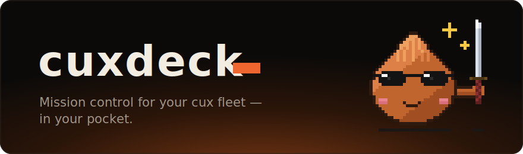

<div align="center">



### Mission control for your overnight AI coding fleet — in your pocket.

*Every Claude Code session on every machine you own — watched, steered,
from any browser on Earth. No accounts. No app store. No servers of ours
in the middle. You install it, and it just works.*

[](LICENSE)
[](https://github.com/centrual/cuxdeck/releases/latest)
[](https://github.com/inulute/cux)

</div>

---

It's **3:47 AM**. Your agent has been refactoring for six hours straight.
It burned through one account's limit, hopped to the next seat without
dropping the conversation, rode out an API outage with patient retries,
and kept going.

You know all this because your phone buzzed once — and because, half-asleep,
you opened a link and *watched it happen*:

```
╭────────────────────────────────────────╮
│  ⌁ cuxdeck                     ● live  │
│                                        │
│  ▸ <your-laptop>           2 sessions  │
│    ~/<a-project>                       │
│      seat <you> · running · 6h 12m     │
│      ▓▓▓▓▓▓▓░░░  tokens                │
│    ~/<side-project>                    │
│      waiting-reset · resets in 02:40 ◔ │
│                                        │
│  ▸ <your-server>            1 session  │
│    ~/<a-pipeline>                      │
│      seat <alt> · running · 41m        │
│                                        │
│  ▸ <gpu-box>                     idle  │
│                                        │
│  SEATS (across fleet)                  │
│    <seat A>  5h ▓▓▓▓▓▓▓░░░             │
│    <seat B>  5h ▓▓░░░░░░░░             │
│    <seat C>  7d ▓▓▓▓▓░░░░░             │
│                                        │
│  [ switch seat ]   [ pause ]           │
╰────────────────────────────────────────╯
```

*Illustrative — your own machines, projects, and seats fill in.*

Then you put the phone down and went back to sleep. The fleet kept working.

**This is cuxdeck.**

---

## Why this exists

[cux](https://github.com/inulute/cux) already turns a pile of Claude accounts
into one tireless pool — it swaps seats at the limit, waits out resets, and
resumes through outages so your agent runs all night. But once you close the
laptop lid, it all happens **in the dark**. Is it alive? Which seat is it on?
Did everything stall at 4 AM waiting for a human who was asleep?

And the moment you run agents on *more than one machine* — a Mac at your desk,
a Linux box in the closet, a GPU rig in the other room — there is no single
place that shows you the whole picture. You SSH into three hosts to answer one
question: *how is my fleet doing?*

Claude Code has a remote feature, but it's tied to the account you logged in
with — and cux's whole job is to keep changing that account. The moment a swap
happens, the session vanishes from your phone.

cuxdeck closes the gap. It is the one screen that answers *"how is everything,
everywhere?"* — and lets you do something about it — from the device that's
already in your hand.

## What it feels like to use

1. **Install** cuxdeck on each machine (see [Install](#install) below —
   Homebrew, a signed-less `.dmg`, a prebuilt binary, or `go build`).
2. **Run it** — it lives in the menu bar. `cuxdeck install` makes it start with
   the computer; from then on it prints a pairing QR and needs no configuration.
3. **Scan the QR.** That machine is now on your phone — live sessions, seat
   usage, projects, and its terminals. Scan the next machine's QR and it joins
   the same fleet view.
4. **Share it.** Invite a teammate with a tap — view-only, or full control.

No sign-ups. No tokens to copy by hand. No VPN client on the phone. No third
party who can see your data. If a step can be removed, it will be.

## Install

**macOS — Homebrew** (menu-bar app):

```
brew tap centrual/tap
brew install --cask cuxdeck
```

Recent Homebrew guards third-party taps, so the first install may ask you to
trust it — run `brew trust centrual/tap` (or the command it prints) and re-run.

**macOS — direct**: grab `cuxdeck-<version>-darwin-universal.dmg` from the
[latest release](https://github.com/centrual/cuxdeck/releases/latest), open it,
and drag cuxdeck to Applications. It's ad-hoc signed, so the first launch is
right-click → Open.

**Linux / Windows**: download the matching archive from the
[releases page](https://github.com/centrual/cuxdeck/releases/latest) and put the
binary on your `PATH`.

**From source** (any platform with Go 1.23+):

```
go install github.com/centrual/cuxdeck/cmd/cuxdeck@latest
```

Every release ships a `checksums.txt`; verify with `shasum -a 256 -c`.

### Requires cux

cuxdeck reads [cux](https://github.com/inulute/cux)'s on-disk session registry —
no patching, no plugin. Everything works against a **stock cux ≥ v0.3.2**:
sessions, seats, projects, the live conversation view, remote session launch.

That includes the **live in-browser terminal** — mirroring and driving a
running session from your phone, keystroke for keystroke. The panel shares
the session's real size, so what you see on the phone matches the desktop
terminal exactly, and touch-scroll pages back through the conversation. It
rides through cux's seat swaps, since the terminal belongs to the wrapper,
not to any one login.

The terminal needs cux's `attach` setting, which is opt-in (off by default)
as of cux 0.3.2 — cuxdeck flips it on at startup, so it works out of the box;
only sessions started *before* that need a restart to become attachable.
Sessions that aren't attachable (or a cux too old to attach) are detected per
session via the `attachable` flag: the terminal button stays hidden and
everything else degrades cleanly.

## How it works

```
                         your phone (one panel, your whole fleet)
                          │            │            │
              ┌───────────┘            │            └───────────┐
              ▼                        ▼                        ▼
     trycloudflare.com        trycloudflare.com        trycloudflare.com
       (tunnel, TLS)            (tunnel, TLS)            (tunnel, TLS)
              ▼                        ▼                        ▼
      cuxdeck @ mac            cuxdeck @ linux          cuxdeck @ gpu-rig
      127.0.0.1                127.0.0.1                127.0.0.1
       reads ~/.cux             reads ~/.cux             reads ~/.cux
       runs `cux`               runs `cux`               runs `cux`
```

- **Server** — one small Go binary bound to `127.0.0.1`. It reads cux's
  on-disk state (accounts, usage cache, project pools, the per-session
  heartbeat registry) and shells out to the `cux` CLI for every action, so
  all the rules stay in cux. It never opens a listening port to the world.
- **Remote access, accountless** — cuxdeck downloads and supervises
  `cloudflared` (over TLS from Cloudflare's official GitHub releases, self-checked
  by running it, kept under `~/.cuxdeck/bin`) and opens a
  [Quick Tunnel](https://developers.cloudflare.com/cloudflare-one/connections/connect-networks/do-more-with-tunnels/trycloudflare/):
  a random `https://….trycloudflare.com` address, **no Cloudflare account
  required**. If the tunnel drops, cuxdeck rebuilds it and pushes your phone
  the new address.
- **The fleet is assembled in your browser, not on a server** — each machine
  is one independent deck with its own tunnel and its own device token. Your
  phone holds the list and merges them into one view. There is no central
  cuxdeck service to sign up for, trust, or take down — add a machine by
  scanning its QR, remove it by forgetting it.
- **Pairing & auth** — the QR encodes the deck's current URL plus a long
  random per-device token. The URL is never the secret: every request is
  authenticated, failed attempts back off, and any device can be revoked from
  the panel. A short manual code covers cameraless setups.
- **Notifications (Web Push, no third parties)** — subscriptions live with
  your browser's push service, not with our URL, so even when a tunnel address
  rotates the old service worker still receives the *"panel moved — tap to
  open"* push and the chain never breaks. Events: tunnel address changed ·
  all seats exhausted (with the reset countdown) · wait-for-reset resumed ·
  API-outage retry started / recovered · session finished (with duration) ·
  a seat needs re-login. Per-event toggles per machine.
- **Telegram (optional, first-class)** — a guided flow if you want alerts in a
  channel that outlives any phone: open BotFather with one tap, paste the
  token, send `/start`; cuxdeck catches the chat id and sends a test message.
  Same events. Never required.

## Principles we won't compromise

- **Zero-step by default.** Anything that asks for an account, a token, or a
  config file has to earn its place — or it's cut. Device pairing is the one
  mandatory step, because security isn't optional.
- **We run no servers.** Your data flows through a tunnel *your machine*
  spawns, straight to *your phone*. We never see it, relay it, or store it.
  There is nothing to trust here but the code in this repo.
- **cux owns the rules.** cuxdeck is a window and a remote control. Every
  change goes through the `cux` CLI; every reading comes from cux's on-disk
  files. No logic forks, no drift.
- **A browser is the only client.** Phone, tablet, someone else's laptop — if
  it renders HTML, it's a cuxdeck client. Add it to your home screen and it
  looks and launches like a native app, with none of the app-store friction.

## Roadmap

| Phase | Scope | Status |
|---|---|---|
| **v1** | daemon + mobile panel (sessions · seats · projects, view & manage) · QR device pairing · accountless tunnel supervisor · start-at-login | ✅ shipped |
| **v2** | multi-machine fleet view (one phone, many decks) · read-only live conversation view · full remote terminal · start a session remotely · Web Push events · Telegram connect wizard | ✅ shipped |
| **v3** | per-seat utilization trend charts · shared team decks (invite with view / control) · menu-bar tray icon · `.dmg` / Homebrew packaging + cross-platform releases | ✅ shipped |
| next | usage cost (once a price signal exists) · a stable named tunnel option · notarized macOS build | planned |

> **Status: usable.** The experience above is real today — install from Homebrew,
> pair a phone, watch and drive your fleet from anywhere. Watch the repo — it's
> moving fast.

## Requirements

- [cux](https://github.com/inulute/cux) ≥ 0.3.2 (attach is opt-in from 0.3.2; cuxdeck enables it for you on start)
- macOS, Linux, or Windows — binaries for all three ship with every release
- A browser on the device you want to watch from. That's the whole list.

## Development

The panel is **React + TypeScript**, bundled by **esbuild used as a Go
library** — the entire toolchain is Go, and React is vendored under
`web/vendor`, so there is no node/npm anywhere in the loop:

```sh
go run ./tools/buildweb   # web/src/*.tsx → internal/server/web/app.js
go build ./cmd/cuxdeck    # single binary, panel embedded
```

The generated bundle is committed, so a plain `go build` always works
without the generate step.

## License

GPL-3.0-only — the same license as [cux](https://github.com/inulute/cux).
Use it, change it, ship it; changes you distribute stay open too. See
[LICENSE](LICENSE).

<div align="center">
<sub>Built alongside <a href="https://github.com/inulute/cux">cux</a>. Not affiliated with Anthropic.</sub>
</div>
